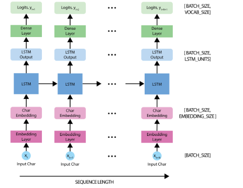
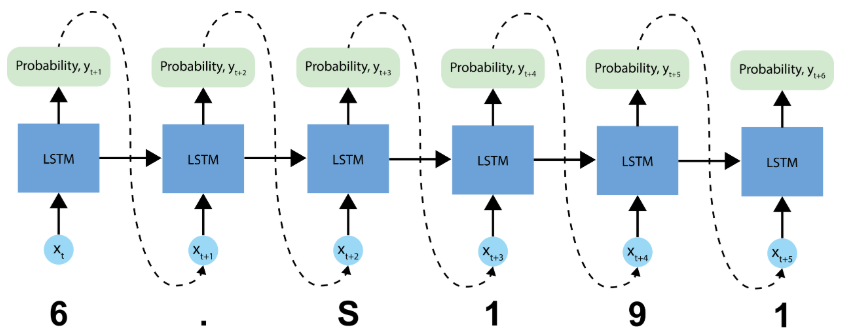

# Music-generation-using-RNN-
this is a lab part of mit's intodeeplearning workshop 

Once we have a generated seed, we can then iteratively predict each successive character (remember, we are using the ABC representation for our music) using our trained RNN. More specifically, recall that our RNN outputs a softmax over possible successive characters. For inference, we iteratively sample from these distributions, and then use our samples to encode a generated song in the ABC format.

Then, all we have to do is write it to a file and listen!

Initialize a "seed" start string and the RNN state, and set the number of characters we want to generate.

Use the start string and the RNN state to obtain the probability distribution over the next predicted character.

Sample from multinomial distribution to calculate the index of the predicted character. This predicted character is then used as the next input to the model.

At each time step, the updated RNN state is fed back into the model, so that it now has more context in making the next prediction. After predicting the next character, the updated RNN states are again fed back into the model, which is how it learns sequence dependencies in the data, as it gets more information from the previous predictions.

